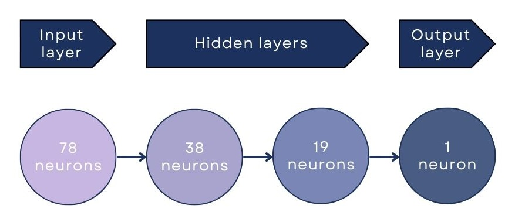

## 👨‍💻 Built with


## 🔍  Description

Data used: [Kaggle](https://www.kaggle.com/wordsforthewise/lending-club)

There are two files in the 'data' folder. First one the actual data (*lending_club_loans.csv*), and the second one is a description of all the columns in the data (*lending_club_info.csv*).

Data CSV file has 27 columns:

```bash
'loan_amnt', 'term', 'int_rate', 'installment', 'grade', 'sub_grade', 'emp_title', 'emp_length', 
'home_ownership', 'annual_inc', 'verification_status', 'issue_d', 'loan_status', 'purpose', 'title', 
'dti', 'earliest_cr_line', 'open_acc', 'pub_rec', 'revol_bal', 'revol_util', 'total_acc', 
'initial_list_status', 'application_type', 'mort_acc', 'pub_rec_bankruptcies', 'address'
```

The goal of this project is to build a model that can predict whether or not a borrower will pay back their loan.

It consists of three parts:
1. Exploratory Data Analysis
2. Data Pre-processing
3. Modeling

## 📊 Exploratory Data Analysis

To handle collected data I used Jupyter Notebook with libraries:
- Pandas
- Numpy
- Seaborn
- Matplotlib

To explore the data I used plots:
- count plot - comparison of different categories
- histogram - distribution in one category
- heatmap - correlations
- scatter plot - distribution in categories and relationship between them
- box plot - statistical comparison between categories
- bar plot - value comparison between fields


## 📝 Data Pre-processing

Data pre-processing consists of three parts:
1. Missing values. Rows like that needs to be either filled or removed.
2. Categorical fields. To be replaced with dummy variables or removed. 
3. Repetative or unnecessary fields. To be removed


## 🤖 Modeling

For the modeling I have created an Artifical Neural Network.

The network has four layers, one input, two hidden and one output.
The shape is shown in the picture below.



I have trained the model for 20 epochs, with batch size 2048.

```bash
Classification report

			Precision	Recall	f1-score

		0 	0.98		0.44	0.61
		1 	0.88 		1.00 	0.93
 Accuracy 				0.89


Confusion matrix

[10253 13110]
[ 250 94953]
```

## 📋 Conclusions

Confusion Matrix tells that the model predicted 105 206 values correctly and 13 360 incorrectly.

There are a few more values in the classification report. They are calculated for both categories, but the ones that describe smaller group (0 - 'Charged Off') are more important.

1. Accuracy is the fraction of predictions that our model got right.  
In this case it's 89%. Accuracy is a good metric when classes are well balanced. In our case they were not. In our data, there is 80% of 'Fully Paid' loans and only 20% of 'Charged Off' loans. So if we created a model that predicts everything as a 'Fully Paid' it would reach 80% accuracy. That's not well balanced dataset. Unfortunately, it's common with datasets like that, where there are two classes of spam/ham, fraud/not fraud, paid/ not paid, etc. It's simply because there are always much more cases of 'good' compared to 'bad'.

2. Precision is a percentage of correct positive predictions relative to total positive predictions. 
In this case it's 98%. That is a pretty good result.  

3. Recall is a percentage of correct positive predictions relative to total actual positives. 
In this case it's 44%. This score is so low, because of the unbalanced data.

4. F1-score is a weighted harmonic mean of precision and recall. The closer to 1, the better the model. 
In this case it's 61%. Not bad not terrible. For this project, the F1-score is the most important metric.